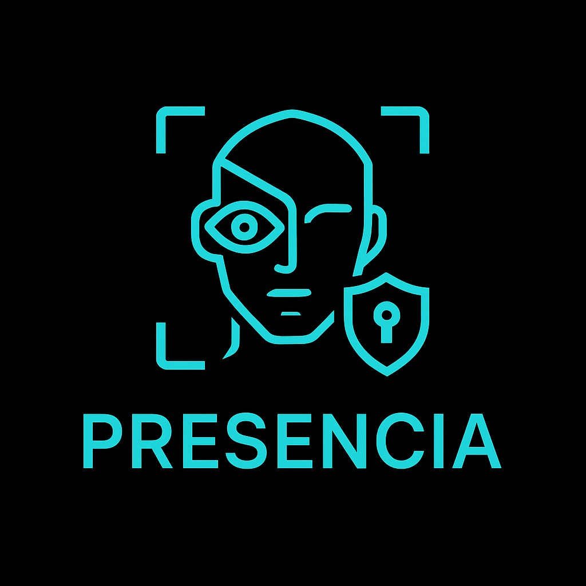

# Presencia: Face Recognition App

<p align="center">

</p>

Presencia is a full-stack attendance management system that leverages facial recognition technology to streamline and secure the process of tracking attendance. Built with a modern tech stack, it offers a seamless experience for both administrators and users.

## 🛠️ Tech Stack

- **Backend:** [NestJS](https://nestjs.com/) (TypeScript)
- **Frontend:** Vanilla JS
- **Facial Recognition:** [Face-api.js](https://github.com/justadudewhohacks/face-api.js)
- **Database:** [MongoDB](https://www.mongodb.com/)
- **Authentication:** Access & Refresh Tokens, Role-Based Access Control (RBAC)
- **Email Services:** [Nodemailer](https://nodemailer.com/)
- **Password Security:** [argon2](https://github.com/ranisalt/node-argon2), [zxcvbn](https://github.com/dropbox/zxcvbn)
- **Validation:** [class-validator](https://github.com/typestack/class-validator)

## 🚀 Features

- **Facial Recognition:** Accurate and efficient face detection for attendance marking.
- **Secure Authentication:** Implements access and refresh tokens for session management.
- **Role-Based Access Control:** Fine-grained permissions for different user roles.
- **Email Verification:** Sends verification emails upon registration.
- **Password Strength Evaluation:** Provides feedback on password strength during registration.
- **Comprehensive Validation:** Ensures data integrity using decorators in DTO classes.

## 📦 Installation

1. **Clone the repository:**
    
    ```bash
    bash
    CopyEdit
    git clone https://github.com/AminelMhl/Presencia.git
    cd Presencia
    
    ```
    
2. **Install dependencies for both backend and frontend:**
    
    ```bash
    bash
    CopyEdit
    # Backend
    cd BackEnd
    npm install
    
    # Frontend
    cd ../FrontEnd
    npm install
    
    ```
    

## 🧪 Running the Application

### Backend

```bash
bash
CopyEdit
cd BackEnd

# Development mode
npm run start:dev

# Production mode
npm run start:prod

```

### Frontend

```bash
bash
CopyEdit
cd FrontEnd
npm start

```

Ensure that both the backend and frontend are running concurrently for full functionality.

## 📁 Project Structure

```
bash
CopyEdit
Presencia/
├── BackEnd/           # NestJS backend application
├── FrontEnd/          # React frontend application
├── FaceRecognition/   # Facial recognition scripts and models
├── README.md          # Project documentation

```

## 🔐 Security Measures

### Password Strength Calculation – `zxcvbn`

- **Why `zxcvbn`?**
    - Developed by Dropbox, it provides realistic password strength estimation.
    - Analyzes patterns, dictionary words, and common substitutions.
    - Offers user-friendly feedback on password choices.

### Class Validator – `class-validator`

- **Why `class-validator`?**
    - Seamlessly integrates with TypeScript and NestJS.
    - Allows declarative validation using decorators.
    - Reduces boilerplate code compared to alternatives like Joi or Yup.

### Password Hashing – `argon2`

- **Why `argon2`?**
    - Winner of the Password Hashing Competition (PHC).
    - Provides resistance against GPU cracking attacks.
    - Preferred over older algorithms like bcrypt for enhanced security.

### Email Verification – `nodemailer`

- **Why `nodemailer`?**
    - Offers complete control over email transport methods.
    - Easily integrates with various email services.
    - Avoids reliance on third-party APIs, ensuring flexibility.

### Token-Based Authentication

- **Why Access/Refresh Tokens?**
    - Balances security and scalability.
    - Short-lived access tokens reduce risk of token theft.
    - Refresh tokens allow seamless re-authentication without compromising security.

### Role-Based Access Control (RBAC)

- **Why RBAC?**
    - Facilitates fine-grained permission management.
    - Scales efficiently with the addition of new roles and permissions.
    - Enhances security by restricting access based on user roles.
  
# Contributors

We extend our heartfelt gratitude to the following individuals who have contributed to the development and success of the Presencia project:

- **[Mohamed Amine Solana](https://github.com/AminelMhl)** 
- **[Rayen Laabidi](https://github.com/laabidiRayen)** 
- **[Achref Msekni](https://github.com/achref-msekni)** 
- **[Aya Saadawi](https://github.com/AyaSaadawi)** 

## 📄 License

This project is licensed under the MIT License.
